# Codex brief: 13 standing side frames for the Game of Us walk sheets

## What this is for

The Game of Us website has a walkable preview where the squad walks around in outfits for six worlds. Every
walk sheet has 9 frames: down (idle, step A, step B), up (idle, A, B), left (idle, A, B). Right-facing is the
left row flipped.

**Frame 6, "left idle", is the problem.** The site draws it whenever a character stands still facing left or
right, and it is also the passing frame in the middle of every sideways step (idle → A → idle → B). In the
13 sheets below, frame 6 was drawn **mid-stride** — feet apart, one leg forward — and neither of the other
two left frames is a standing pose either, so there is nothing to swap in. Characters stand frozen mid-step
and the walk looks like a shuffle.

**Regenerate exactly one frame per sheet: the same character, same outfit, facing left, standing still
with straight legs.** Nothing else in the sheet changes.

## The rules

**Only the pose changes. The character and the outfit stay exactly the same, one to one.**

- **Facing:** left, true side profile, the same angle as the frame being replaced.
- **Pose:** standing still. Both legs straight and vertical, feet side by side and flat on the ground, the
  nearer foot slightly overlapping the far one. Arms relaxed down at the sides. No stride, no raised heel,
  no bent knee. See `standing_pose_example_4x.png` in each folder for the pose.
- **Keep identical to the frame being replaced (`redo_this_frame_4x.png`) and its step frames
  (`same_facing_step_frames_4x.png`):** face, hair, sunglasses, head size, body proportions, height, every
  piece of the outfit and its colours, and anything carried (skis, backpack, satchel, lute, helmet).
- **Style:** the same polished pixel art as the sheet — same outline weight, shading and palette depth.
  Don't make it smoother or more detailed than the frames next to it.
- **Nala is a pug.** Standing still means all four legs straight down and planted, body level, tail curled
  up. Face, ears, mask and tongue unchanged.
- **Elias (fairy)** wears a long robe: his legs should be straight and together under it, with the robe
  hanging straight down rather than swinging.
- **The two beach sheets (Kai, Ethan) are the characters' own clothes**, not an outfit — match the sheet
  exactly.

## Output

- **One PNG per job**: a single full-body figure on a **pure black `#000000` background** (every background
  pixel exactly 0,0,0 — no gradient, glow, shadow or floor), or on real transparency. Any square size;
  1024×1024 is fine. One figure, nothing else in the image.
- Leave some margin round the figure; don't crop any part of it.
- **Save it as exactly the filename in the table**, into
  `/Users/linusstamovyu/Downloads/Frokost Pokemon/gameofus-site/source/outfits/regen-requests/out/`.

Don't size it, place it or cut the background yourself. The site's recut tool keys the black, scales the
figure to that sheet's own side frames, stands it on the sheet's foot line and swaps it into frame 6.

## Reference images

Every job folder is under
`/Users/linusstamovyu/Downloads/Frokost Pokemon/gameofus-site/source/outfits/regen-requests/refs/`,
and holds the same four files:

| File | What it is |
|---|---|
| `redo_this_frame_4x.png` | **The frame to replace** (frame 6), 4× nearest-neighbour on grey. Identity, outfit and facing come from here. `redo_this_frame.png` is the same frame at native 128×256. |
| `same_facing_step_frames_4x.png` | Frames 7 and 8 of the same sheet: more views of the same outfit facing the same way. |
| `standing_pose_example_4x.png` | A standing side pose from another sheet, for the **pose only** (legs and arms). Never copy its clothes or face. |
| `full_sheet.png` | The whole 9-frame sheet, for anything the other three don't show. |

`all_13_frames_to_redo.png` in `refs/` shows all 13 frames side by side.

## The 13 jobs

| # | Character | World | Reference folder (in `refs/`) | Frame to redo | Pose example from | Save as (in `out/`) |
|---|---|---|---|---|---|---|
| 1 | Kai | Beach (own clothes) | `kai_walk_beach/` | 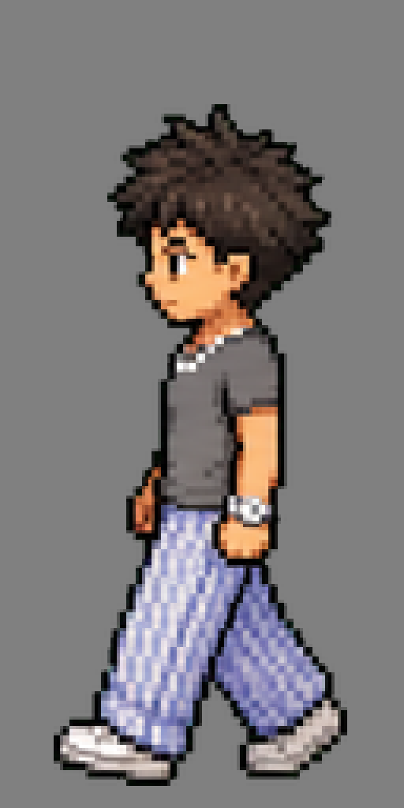 | Kai, fairy | `kai_walk_beach_cell6.png` |
| 2 | Kai | Ski village | `kai_walk_ski/` | 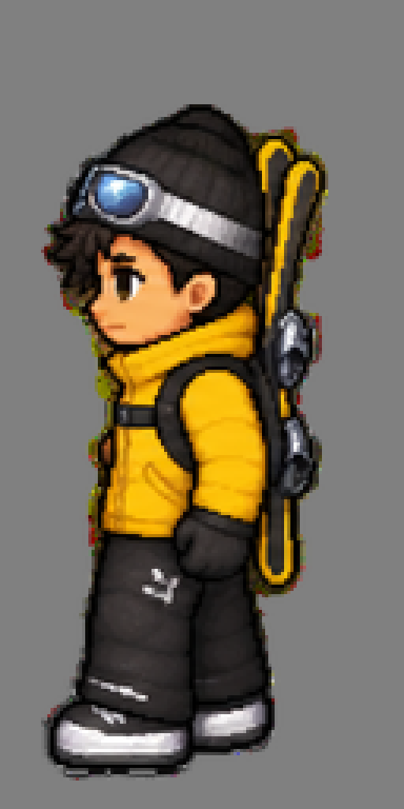 | Kai, fairy | `kai_walk_ski_cell6.png` |
| 3 | Kai | Neon city | `kai_walk_neon/` | 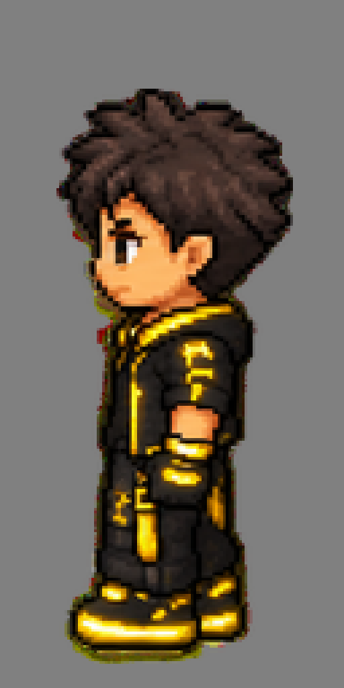 | Kai, fairy | `kai_walk_neon_cell6.png` |
| 4 | Kai | Jungle temple | `kai_walk_jungle/` | 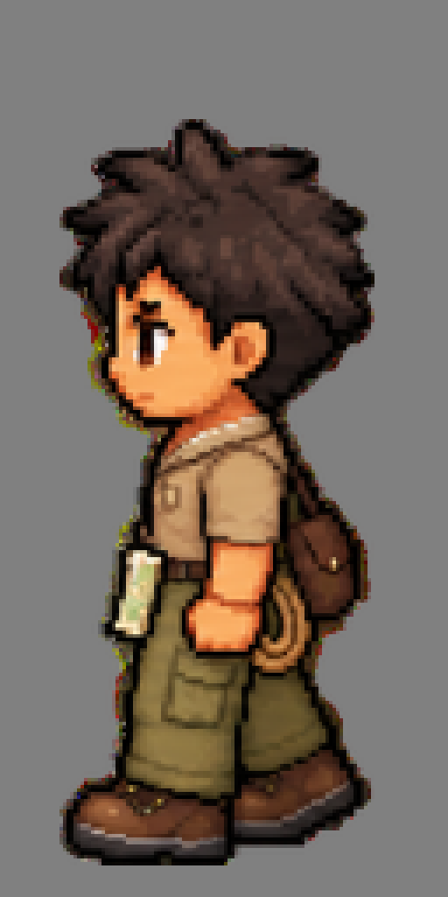 | Kai, fairy | `kai_walk_jungle_cell6.png` |
| 5 | Kai | Mars base | `kai_walk_mars/` | 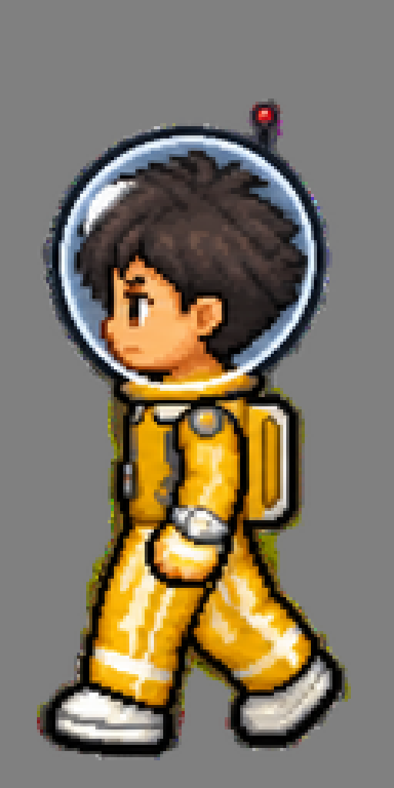 | Kai, fairy | `kai_walk_mars_cell6.png` |
| 6 | Ethan | Beach (own clothes) | `ethan_walk_beach/` | 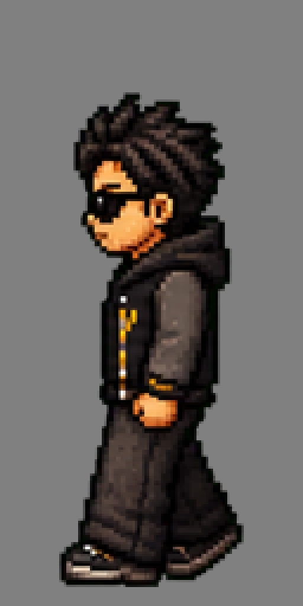 | Rico, beach | `ethan_walk_beach_cell6.png` |
| 7 | Ethan | Ski village | `ethan_walk_ski/` | 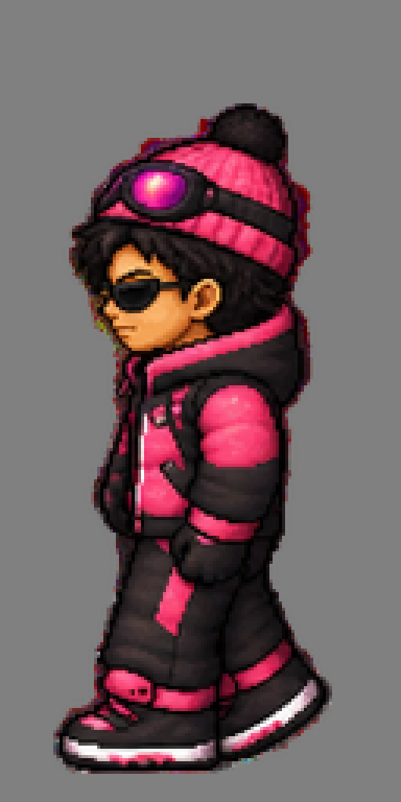 | Rico, beach | `ethan_walk_ski_cell6.png` |
| 8 | Ethan | Neon city | `ethan_walk_neon/` | 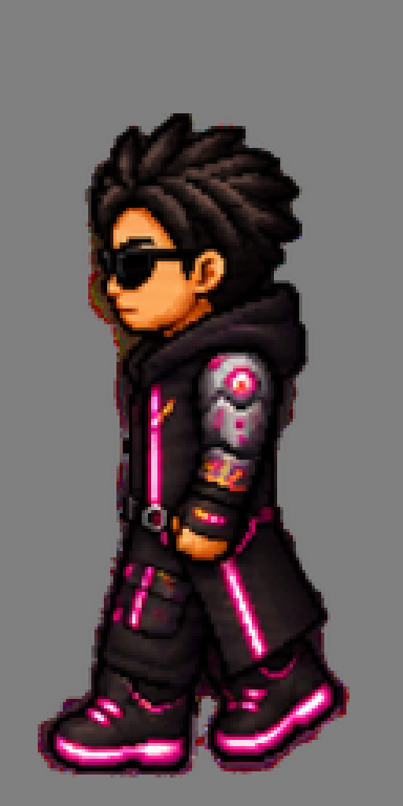 | Rico, beach | `ethan_walk_neon_cell6.png` |
| 9 | Ethan | Jungle temple | `ethan_walk_jungle/` | 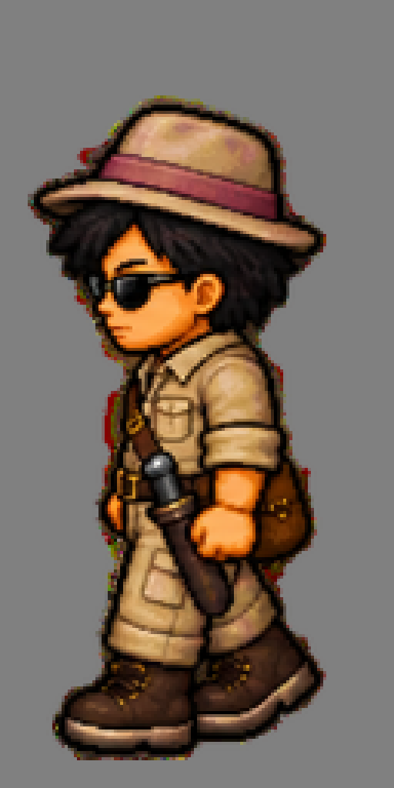 | Rico, beach | `ethan_walk_jungle_cell6.png` |
| 10 | Ethan | Fairy-tale land | `ethan_walk_fairy/` | 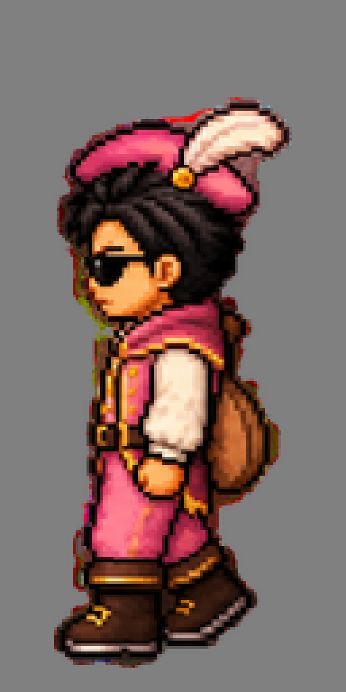 | Rico, beach | `ethan_walk_fairy_cell6.png` |
| 11 | Ethan | Mars base | `ethan_walk_mars/` | 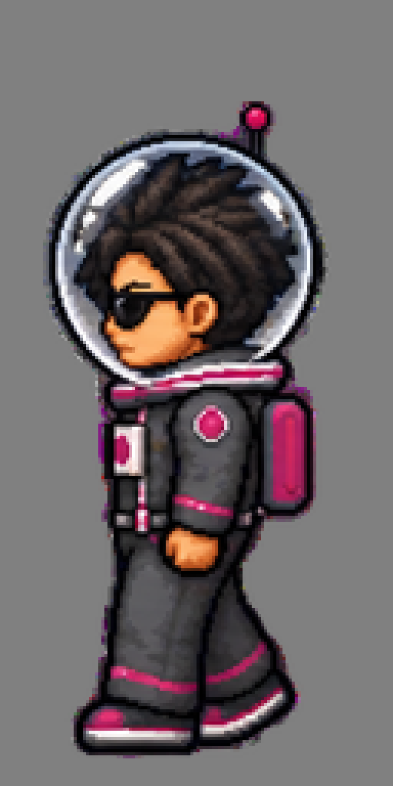 | Rico, beach | `ethan_walk_mars_cell6.png` |
| 12 | Elias | Fairy-tale land | `elias_walk_fairy/` | 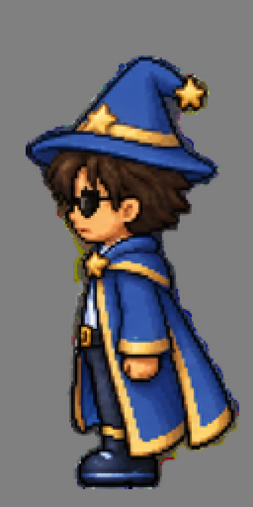 | Elias, beach | `elias_walk_fairy_cell6.png` |
| 13 | Nala (pug) | Neon city | `nala_walk_neon/` | 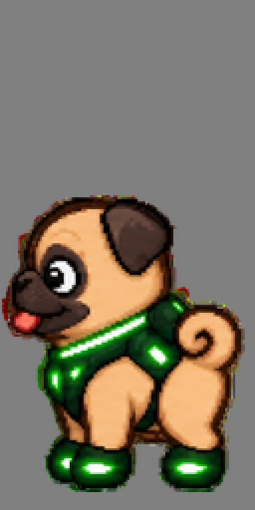 | Nala, beach | `nala_walk_neon_cell6.png` |

For each job, generate with these images as references, in this order:
1. `redo_this_frame_4x.png`, for identity and outfit
2. `same_facing_step_frames_4x.png`, for identity and outfit
3. `standing_pose_example_4x.png`, for the pose only

A prompt that works:

> Pixel-art game sprite, full body, facing left in side profile, standing still: both legs straight and
> vertical, feet together flat on the ground, arms relaxed at the sides. The character and outfit must be
> identical to the first two reference images (same face, hair, sunglasses, proportions, clothes, colours and
> carried items); take only the standing pose from the third image. Same pixel-art rendering, outline weight
> and shading as the references. A single figure on a pure solid black #000000 background, no shadow, no
> floor, nothing else in the image.

## Check before handing back

- Legs straight and together, no foot lifted. Put it next to `redo_this_frame_4x.png`: the only differences
  should be the legs and arms.
- Same outfit piece for piece, same colours, sunglasses where the reference has them.
- Background pure `#000000` (or transparent), with no black inside the character turned transparent.
- 13 files in `out/`, named exactly as in the table.

## After the files land (for Claude, not Codex)

```bash
python3 tools/recut_outfit_sheets.py            # swaps frame 6 into the outfit sheets
python3 tools/deploy_regenerated_outfits.py     # public/worlds
npm run assets                                  # beach sheets (Kai, Ethan) from out/*_beach_cell6.png
```
